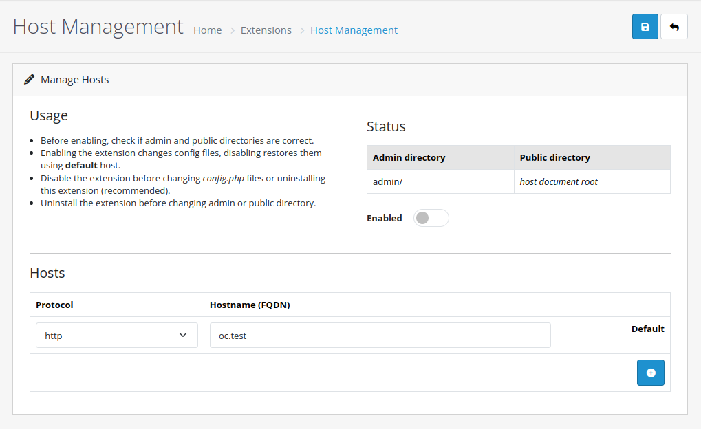

# oc-host-management

Allows multiple hosts for default OpenCart store.

Extension is intended for development purposes, to be used with tunelling services (like Ngrok).

## Requirements

- php 8.2
- OpenCart 4.0.2.3 (wasn't tested with other 4.x.x.x versions, might work)

## Impelmentation

OpenCart ignores *Host* HTTP header for it's main store, and uses a named constant which is set within it's config files during installation. That constant is spread throughout various config arrays at startup, but it is also used directly in some files. There is no elegant way around, so this extension **changes config files** when enabled - specifically `/config.php` and `/admin/config.php` (or wherever your admin directory is). The files are restored when extension is disabled, or during uninstall.

## Usage

- Pack files within `host_management` direcory (not the directory itself) into `host_management.ocmod.zip` archive.
- Use the *Extension Installer*.
- Go to *Extensions*, filter to *Other* and install.
- *Edit* page shows your admin and public directory paths, default host and protocol (in case those weren't detected, there will be a notification).
- If everything looks good you can add new hosts and enable the extension. Once you save, config files will be edited if you enabled the extension.
- If server doesn't have write access to either of the config files, you'll get a notification and extension won't be enabled.
- It is recommended to disable the extension before uninstalling. Though it will try to restore config files, OpenCart doesn't offer any means of notifying or aborting during uninstall if something goes wrong.

---

